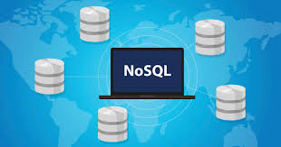
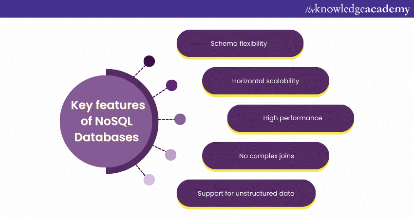
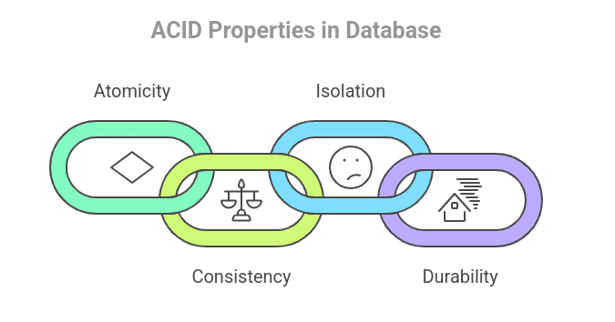
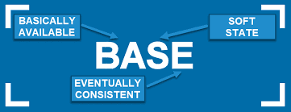
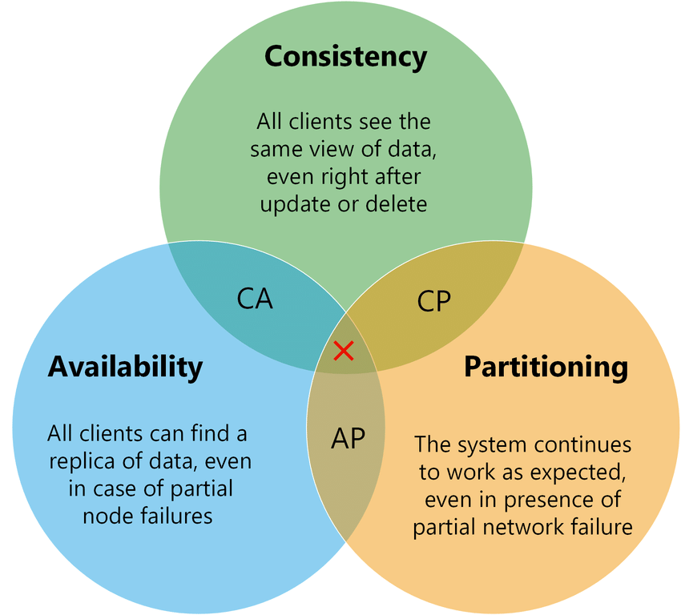

# Introduction to NoSQL Databases 

## Introduction
In modern software systems, data is growing rapidly. Applications like social media, online shopping platforms, ride-sharing apps, and IoT devices generate **huge volumes of data every second**.

Traditional databases (SQL or relational databases) are powerful but they can struggle when:
- Data becomes too large (Big Data)
- Data structure keeps changing
- Systems need to handle millions of users at the same time

To solve these problems, **NoSQL databases** were introduced.

 NoSQL databases are designed to be:
- Flexible  
- Scalable  
- Fast  
- Distributed  


##  What is NoSQL?


NoSQL stands for **“Not Only SQL.”**

It is a type of database that does not rely only on tables and rows like traditional relational databases.

### Definition 
NoSQL databases are **non-relational databases** that store data using flexible schemas and alternative data models such as key-value, document, column-family, and graph, designed for **scalability and high availability**.

In simple words:  
NoSQL allows to store data in a **more flexible way** and scale system easily.


##  Why Do We Need NoSQL?

Let’s understand with a simple example:

Imagine building a **social media app**:
- Users can have different profile fields
- Posts may contain text, images and videos
- Millions of users are active at the same time

 Using SQL:
- It must define a fixed schema
- Scaling is difficult (requires powerful servers)

 Using NoSQL:
- It can store flexible data (JSON)
- It can scale by adding more servers


##  Key Features of NoSQL



### 1. Flexible Schema
In NoSQL, don’t need to define a strict structure.

Example:
```json
{ "name": "Tshewang", "age": 21 }
{ "name": "Karma", "email": "karma@gmail.com" }
````

Both records can exist in the same database.

---

### 2. Non-Relational Data Model

Unlike SQL (tables), NoSQL uses:

* Key-value pairs
* JSON documents
* Graphs
* Columns

 This makes it easier to store complex data.


### 3. Horizontal Scalability

Instead of upgrading one powerful server, it can:
 Add more servers (scale-out)

This is useful for:

* Large applications
* Global systems


### 4. Distributed and Fault-Tolerant

Data is stored across multiple machines.

 If one server fails:

* The system still works
* Data is not lost


### 5. High Availability

NoSQL systems are designed to:

* Always respond to user requests
* Avoid downtime


##  BASE vs ACID

###  ACID (SQL Databases)



ACID properties ensure that database transactions are **safe, reliable and consistent**, especially in critical systems like banking.

#### 1. Atomicity (All or Nothing)
Atomicity means a transaction is treated as a single unit.

Either:
- All operations are completed successfully  
- OR none of them happen at all  

Example:  
If i transfer money from Account A to Account B:
- Money must be deducted from A **and** added to B  
- If one step fails, everything is cancelled  

 This prevents partial updates (which can cause serious errors).


#### 2. Consistency (Correct Data Always)
Consistency ensures that the database always remains in a **valid state**.

Before and after a transaction:
- All rules (constraints) must be followed  
- Data must be correct  

 Example:
- A bank account balance cannot be negative (if rule exists)  
- After a transaction, all data must follow defined rules  

 If something breaks the rules, the transaction is rejected.


#### 3. Isolation (Transactions Don’t Interfere)
Isolation ensures that multiple transactions happening at the same time do not affect each other.

Each transaction works as if it is the only one running.

Example:
- Two people try to withdraw money from the same account at the same time  
- The system processes them in a controlled way to avoid wrong balance  

This prevents issues like:
- Dirty reads  
- Lost updates  


#### 4. Durability (Data is Permanent)
Durability means once a transaction is completed, the data is **permanently saved**, even if the system crashes.

 The database uses logs and backups to ensure data is not lost.

 Example:
- After transferring money, even if power goes off, the transaction is saved.  

 This ensures trust and reliability.


###  Why ACID is Important
ACID is very important in systems like:
- Banking 
- E-commerce payments   
- Reservation systems   

 Because even a small error can cause **huge problems**.


### BASE (NoSQL Databases)



BASE is a concept used in NoSQL databases to handle data in **large and distributed systems**.  
It focuses on **availability and scalability** instead of strict consistency like ACID.


#### 1. Basically Available (System Always Responds)
This means the system will **always give a response** even if the data is not the latest.

The system prefers:
- Returning some data  
- Instead of showing an error or timeout  

 Example:
- Open a social media app and see posts  
- Some posts may be slightly outdated, but the app still loads quickly  

This ensures a **smooth user experience**.

#### 2. Soft State (Data Can Change)
Soft state means the system’s data is **not fixed immediately** and may change over time.

Why?
- Because data is stored across multiple servers  
- These servers are constantly syncing with each other  

 Example:
- If i like a post  
- The like count may not update instantly everywhere  

The data is "temporary" until all systems sync.


#### 3. Eventual Consistency (Consistency Over Time)
Eventual consistency means that:
After some time all copies of data will become the same

- Updates are not instant across all servers  
- But they will **eventually match**

Example:
- If i send a message or follow someone  
- It may take a few seconds to reflect everywhere  

This is acceptable in apps where **perfect accuracy is not critical immediately**.


### Why BASE is Important
BASE is useful for systems that need:
- High speed   
- High availability   
- Large-scale data handling 


###  Where BASE is Used
- Social media apps (Facebook, Instagram)  
- Chat applications   
- Online streaming platforms   
- Real-time analytics  

 These systems prioritize:
**“Fast and always available” over “perfectly consistent at all times.”**


###  Key Idea:

* SQL: **Accuracy and reliability**
* NoSQL: **Speed and scalability**


## NoSQL vs Relational Databases

| Feature        | SQL (Relational) | NoSQL                  |
| -------------- | ---------------- | ---------------------- |
| Structure      | Tables           | Flexible formats       |
| Schema         | Fixed            | Flexible               |
| Scaling        | Vertical         | Horizontal             |
| Consistency    | Strong           | Eventual               |
| Query Language | SQL              | API / JSON             |
| Use Case       | Banking          | Social media, big data |


## CAP Theorem (Very Important)



CAP theorem explains the **limitations of distributed systems** (systems that run on multiple servers).

It states that a distributed database can only guarantee **two out of three properties** at the same time:


### The Three Properties

#### 1. Consistency (C)
Consistency means:
All users see the **same and latest data** at the same time.

Example:
- If i update my profile name,
- Everyone should see the updated name immediately.

No outdated or conflicting data is allowed.


#### 2. Availability (A)
Availability means:
The system will **always respond to every request**.

Example:
- When we open an app, it always loads data
- Even if some servers are down

We never get an error or timeout.


#### 3. Partition Tolerance (P)
Partition tolerance means:
The system continues to work even if there is a **network failure** between servers.

 Example:
- If one server cannot communicate with another,
- The system still keeps running

This is very important in distributed systems.


### Key Rule of CAP
We **cannot achieve all three (C, A, P)** at the same time.

In real-world systems:
- Network failures **can happen anytime**
- So **Partition Tolerance (P) is mandatory**


## Real-World Choices

Since P is required, systems must choose between:


###  CP (Consistency + Partition Tolerance)
- Data is always correct and consistent  
- But the system may **stop responding temporarily**

 Example:
- Bank systems  
- Payment systems  

If there is a network issue:
- The system may block transactions  
- To avoid incorrect data  


### AP (Availability + Partition Tolerance)
- System always responds  
- But data may be **slightly outdated**

 Example:
- Social media apps  
- Instagram, Facebook  

 If there is a network issue:
- The system still shows data  
- Even if it is not the latest version  


##  Simple Analogy

Imagine a group of friends sharing notes:

- **Consistency** - Everyone has the same latest notes  
- **Availability** - Everyone always gets notes when asked  
- **Partition** - Some friends cannot communicate  

If communication breaks:
- either wait for correct notes (**CP**)  
- Or use old notes but continue (**AP**)  


## Summary
- CAP = Consistency, Availability, Partition Tolerance  
- We can only choose **2 out of 3**  
- In real systems, **P is always required**  

So the real choice is:
- **CP → Correct but may be unavailable**  
- **AP → Available but may be slightly inconsistent**  


## Final Insight
 Systems must choose between **accuracy** and **availability** during network failures.

- Banking → Choose **accuracy (CP)**  
- Social media → Choose **availability (AP)**  


## Types of NoSQL Databases


### 1. Key-Value Store

* Data stored as: key → value
* Very fast and simple

Example use:

* Caching
* Session storage


### 2. Document Database

* Stores data in JSON format
* Flexible structure

Example use:

* Blogs
* User profiles
* Product catalogs


### 3. Column-Family Database

* Stores large-scale data
* Optimized for fast writes

 Example use:

* Logs
* Big data analytics


### 4. Graph Database

* Stores relationships between data

Example use:

* Social networks
* Recommendation systems


### 5. Time-Series Database

* Stores time-based data

 Example use:

* IoT sensors
* Monitoring systems


### 6. Vector Database

* Stores embeddings (AI data)

Example use:

* Semantic search
* AI chat systems


## Use Cases of NoSQL

### 1. Big Data Processing

* Handles large volumes of data
* Works with tools like Spark


### 2. Real-Time Applications

* Chat apps
* Live notifications
* Social media feeds


### 3. Content Management Systems (CMS)

* Flexible content storage
* Easy updates


### 4. Internet of Things (IoT)

* Stores sensor data
* Handles continuous streams


### 5. AI and Machine Learning

* Used for similarity search
* Recommendation systems


## Choosing the Right NoSQL Database

When designing a system, consider:

### 1. Data Structure

* JSON - Document DB
* Relationships - Graph DB


### 2. Access Pattern

* Simple lookup - Key-value
* Complex queries - Document


### 3. Scalability Needs

* Huge data - Column-family


### 4. Consistency Requirements

* Strong consistency - Banking
* Eventual consistency - Social apps


### 5. Ecosystem & Tools

* Community support
* Libraries
* Cloud services

##  Common Mistakes

*  Thinking that NoSQL replaces SQL
*  Ignoring CAP theorem
*  Using NoSQL for financial systems
*  Designing like relational databases


## Conclusion

NoSQL databases are essential for modern applications because they:

* Handle large-scale data
* Provide flexibility
* Support distributed systems

However, they are not always the best choice.

The best approach is:

* Use SQL when we need **strong consistency**
* Use NoSQL when we need **scalability and flexibility**


