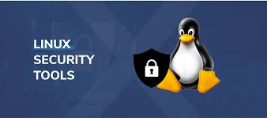
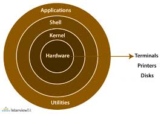

Linux started because people wanted a free and open alternative to Unix, which was created in the 1970s. Many projects tried, but none succeeded until Linus Torvalds, a Finnish student, created the Linux kernel in 1991. Over time, Linux grew into a powerful and widely used operating system.

Linux is free, open-source, and known for its security, stability, and high performance. However, it can be harder for beginners and has fewer hardware drivers than Windows. There are over 600 versions (called distributions or "distros"), including Ubuntu, Fedora, and Debian.

Linux is used in many devices, from computers and servers to smartphones (Android is based on Linux). One specific Linux distro, Parrot OS, is focused on security and privacy and is used in ethical hacking.

Think of Linux as a company where different parts (like the kernel and software) work together like employees, following a structured system and a shared philosophy of openness and collaboration.

### **Linux Philosophy & Structure (Simplified)**

### **Philosophy**

Linux follows a simple and modular approach, meaning it uses small programs that do one job well. These can be combined to perform complex tasks efficiently.

**Core Principles:**

1. **Everything is a file** – Configuration files are stored as text files.
2. **Small, single-purpose programs** – Many tools are designed to do one job but can be used together.
3. **Chaining programs** – Different tools can be combined to complete complex tasks.
4. **No forced user interfaces** – Linux relies on the command-line (terminal) for better control.
5. **Text-based configuration** – System settings are stored in text files (e.g., `/etc/passwd`).

### **Key Components of Linux**

- **Bootloader** – Starts the OS (e.g., GRUB).
- **Kernel** – The core of Linux, managing hardware resources.
- **Daemons** – Background services (e.g., printing, scheduling).
- **Shell** – Command-line interface (e.g., Bash, Zsh, Fish).
- **Graphics Server** – Manages graphical programs (e.g., X-server).
- **Window Manager** – Provides a graphical interface (e.g., GNOME, KDE).
- **Utilities** – Small programs that help users and the system.

### **Linux Architecture (Layers)**

1. **Hardware** – Physical components like RAM, CPU, and storage.
2. **Kernel** – Manages hardware resources and process execution.
3. **Shell** – Lets users interact with the OS through commands.
4. **System Utilities** – Provides essential tools for managing Linux.

### **File System Hierarchy**

Linux organizes files in a tree structure, with **`/` (root)** as the top-level directory.

- **`/bin`** – Essential system commands.
- **`/boot`** – Files needed to start the OS.
- **`/dev`** – Files for hardware devices.
- **`/etc`** – Configuration files.
- **`/home`** – Personal files for users.
- **`/lib`** – Libraries required by the system.
- **`/media`** – External drives (USB, CD).
- **`/mnt`** – Temporary mount point.
- **`/opt`** – Third-party software.
- **`/root`** – Home directory for the admin (root user).
- **`/sbin`** – System administration commands.
- **`/tmp`** – Temporary files.
- **`/usr`** – Installed software, manuals, etc.
- **`/var`** – Variable data like logs and emails.

Linux is structured, efficient, and highly customizable, making it ideal for servers, embedded devices, and even smartphones (Android).
Sure! Here's a simplified and organized version of your notes on **Linux Distributions**:

---

### **Linux Distributions (Distros) – Simple Notes**

#### What is a Linux Distribution?
- An **operating system** based on the **Linux kernel**.
- Used in **servers, desktops, mobile phones, embedded systems**, and more.
- Like different branches of the same company—same core, but customized for different uses.

---

### Key Features of Linux Distros
- **Free**, **open-source**, and **customizable**
- Includes different **features, packages, and tools**
- Designed for different users: beginners, professionals, enterprises, etc.

---

### Popular Linux Distros
- **Ubuntu** – Beginner-friendly, great for desktops
- **Fedora** – Cutting-edge software, also beginner-friendly
- **CentOS** – Stable, used for servers (RHEL clone)
- **Debian** – Very stable and secure, used for servers and desktops
- **Red Hat Enterprise Linux (RHEL)** – Enterprise-focused
- **Kali Linux** – Most popular for cybersecurity, full of security tools

---

### Why Use Linux?
- Open source = source code is visible and modifiable
- Highly customizable for any specific task
- Great for **cybersecurity** because of transparency and flexibility
- Regular updates and strong security

---

### Cybersecurity-Focused Distros
- **Kali Linux** – Full suite of hacking and testing tools
- **ParrotOS** – Lightweight and privacy-focused
- **BlackArch** – Arch-based, advanced security tools
- **BackBox, Pentoo** – Specialized security distros
- **Ubuntu, Debian, CentOS, Raspberry Pi OS** – Also usable depending on need

---

### About **Debian**
- Known for: **Stability, Reliability, Security**
- Great for: **Servers, desktops, embedded systems**
- Uses **APT (Advanced Package Tool)** for easy software updates
- Offers **long-term support** (up to 5 years)
- Great for advanced users – very **customizable**, but may have a steeper learning curve
- Strong community and regular security patches

---

### Summary
- Linux distros serve different use cases.
- Cybersecurity experts prefer open-source and secure systems.
- Debian stands out for its reliability and strong security.
- With basic Linux command knowledge, tasks become easier over time.

